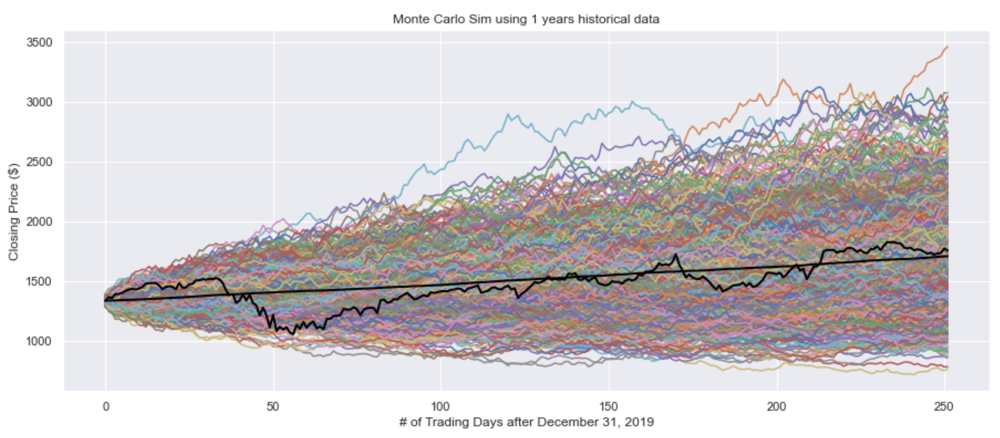

## Monte Carlo Simulations for Stock prices
- Plots Monte Carlo Simulations using Geometric Brownian Motion
- Compares values predicted using the Monte Carlo Simulation with the actual stock prices
- Jagged black line on Monte Carlo Simulation is actual stock price
- Straight black line on Monte Carlo Simulation is the value predicted by the simulation
- Uses different amounts of historical data in the equation to evaulate which amount of historical data used is most effective in predicting stock prices

<a href="https://nbviewer.org/github/yangchristina/stock-prices-monte-carlo-sim/blob/main/stock%20prices%E2%80%93Monte%20Carlo%20Sim.ipynb" target="_blank">View notebook in nbviewer</a>